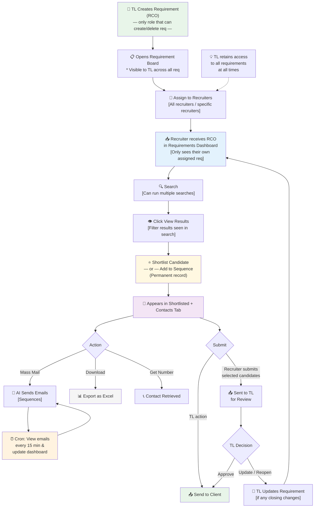
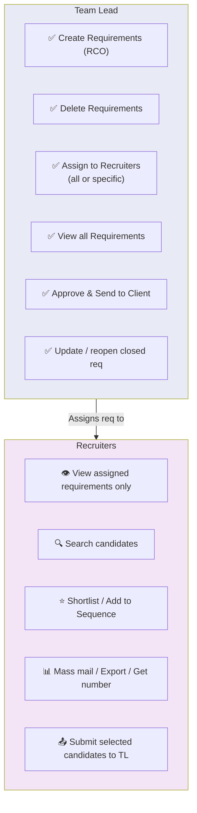
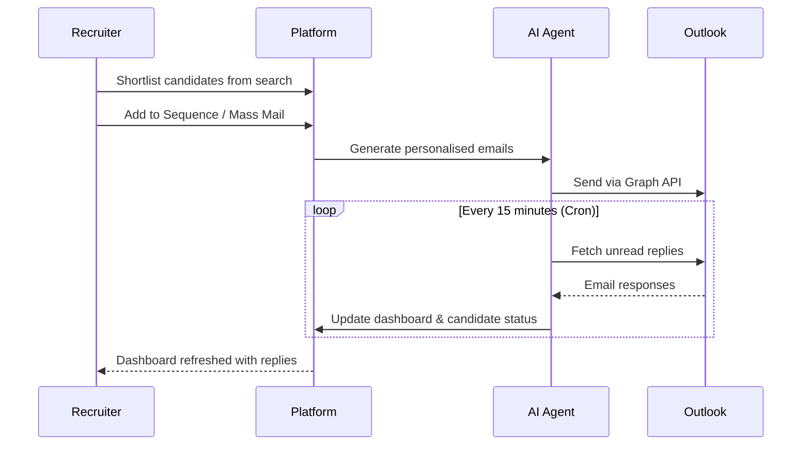

# Beroz — RCO Lifecycle & Recruiter Workflow

## Full RCO Flow

```mermaid
flowchart TD
    A["👤 TL Creates Requirement\n(RCO)\n— only role that can create/delete req —"] --> B["📋 Opens Requirement Board\n* Visible to TL across all req"]

    B --> C["📨 Assign to Recruiters\n[All recruiters / specific recruiters]"]

    note1["💡 TL retains access\nto all requirements\nat all times"] -.-> C

    C --> D["📥 Recruiter receives RCO\nin Requirements Dashboard\n[Only sees their own assigned req]"]

    D --> E["🔍 Search\n[Can run multiple searches]"]

    E --> F["👁️ Click View Results\n[Filter results seen in search]"]

    F --> G["⭐ Shortlist Candidate\n— or — Add to Sequence\n(Permanent record)"]

    G --> H["📂 Appears in Shortlisted + Contacts Tab"]

    H --> I{Action}

    I -->|"Mass Mail"| J["🤖 AI Sends Emails\n[Sequences]"]
    I -->|"Download"| K["📊 Export as Excel"]
    I -->|"Get Number"| L["📞 Contact Retrieved"]

    J --> M["⏰ Cron: View emails\nevery 15 min &\nupdate dashboard"]
    M --> J

    H --> N{Submit}
    N -->|"Recruiter submits\nselected candidates"| O["📤 Sent to TL\nfor Review"]
    N -->|"TL action"| P["📤 Send to Client"]

    O --> Q{TL Decision}
    Q -->|"Approve"| P
    Q -->|"Update / Reopen"| R["🔄 TL Updates Requirement\n[if any closing changes]"]
    R --> D

    style A fill:#e8f5e9
    style D fill:#e3f2fd
    style G fill:#fff8e1
    style H fill:#f3e5f5
    style P fill:#e8f5e9
    style K fill:#f5f5f5
    style M fill:#fff3e0
```

---

## Role Permissions Summary

```mermaid
flowchart TD
    subgraph TL["Team Lead"]
        T1["✅ Create Requirements (RCO)"]
        T2["✅ Delete Requirements"]
        T3["✅ Assign to Recruiters\n(all or specific)"]
        T4["✅ View all Requirements"]
        T5["✅ Approve & Send to Client"]
        T6["✅ Update / reopen closed req"]
    end

    subgraph REC["Recruiters"]
        R1["👁️ View assigned requirements only"]
        R2["🔍 Search candidates"]
        R3["⭐ Shortlist / Add to Sequence"]
        R4["📊 Mass mail / Export / Get number"]
        R5["📤 Submit selected candidates to TL"]
    end

    TL -->|"Assigns req to"| REC

    style TL fill:#e8eaf6
    style REC fill:#f3e5f5
```

---

## Outreach Sequence & Inbox Loop

```mermaid
sequenceDiagram
    participant R as Recruiter
    participant App as Platform
    participant AI as AI Agent
    participant Outlook as Outlook

    R->>App: Shortlist candidates from search
    R->>App: Add to Sequence / Mass Mail
    App->>AI: Generate personalised emails
    AI->>Outlook: Send via Graph API

    loop Every 15 minutes (Cron)
        AI->>Outlook: Fetch unread replies
        Outlook-->>AI: Email responses
        AI->>App: Update dashboard & candidate status
    end

    App-->>R: Dashboard refreshed with replies
```
